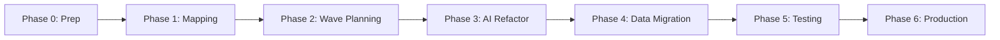
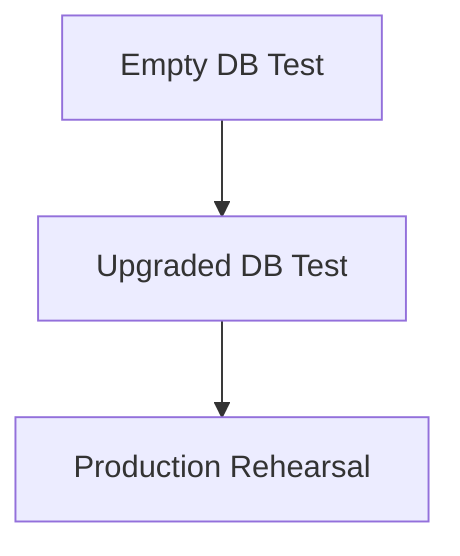

# 🚀 AI-Assisted Odoo v16 → v19 Migration Plan
*Professional Enterprise-Grade Migration Framework*

> **Document Version:** 1.0  
> **Target:** Odoo 19.0 (Stable, April 2026)  
> **Scope:** Custom modules with dependency-aware, AI-assisted refactoring  
> **Philosophy:** "Map First, Refactor Second, Validate Always"

---

## 🎯 Executive Summary

This migration plan implements a **RAG-based (Retrieval-Augmented Generation) pipeline** for upgrading Odoo custom modules from v16 to v19. Instead of relying on AI memory, we ground every refactor in a machine-readable **Migration-Reference Document** derived from static analysis of your codebase.

### Core Principles
- ✅ **Explicit over Implicit**: All changes documented in `migration-reference.yaml`
- ✅ **Atomic Units**: Migrate dependency clusters ("Waves"), not isolated modules
- ✅ **Code ≠ Data**: Separate tracks for Python/XML refactoring and database schema migration
- ✅ **Validate Incrementally**: Test each Wave on fresh v19 DB before proceeding
- ✅ **Token Efficiency**: AI sees only diffs + rules, not entire codebases

---

## 📋 High-Level Migration Phases



---

## 🔧 PHASE 0: PREPARATION (Week 1)

### ✅ 0.1 Environment Setup
- [ ] Create dedicated migration Git branch: `git checkout -b migration/v16-to-v19`
- [ ] Backup production database: `pg_dump -U odoo prod_db > backup_v16_$(date +%F).sql`
- [ ] Set up parallel Odoo instances:
  - `odoo16/` → v16 source + v16 DB (read-only reference)
  - `odoo19/` → v19 source + empty test DB (migration target)
- [ ] Install migration tooling: `pip install lxml astor pyyaml`

### ✅ 0.2 Inventory Custom Modules
```bash
# Generate module manifest inventory
find ./custom_addons -name "__manifest__.py" -exec grep -H "name\|version\|depends" {} \; > module_inventory.txt

# Quick dependency scan
grep -r "\"depends\"" ./custom_addons --include="__manifest__.py" > dependencies_raw.txt
```

### ✅ 0.3 Define Migration Scope
| Criteria | Action |
|----------|--------|
| Module uses deprecated APIs (`_cr`, `_context`, `attrs`) | Flag for AI refactor |
| Custom feature now standard in v19 | Mark for deletion, not migration |
| Module has no custom logic (views only) | Bulk RegEx migration, skip AI |
| Module depends on unmaintained 3rd-party | Evaluate replacement first |

---

## 🗺️ PHASE 1: STRUCTURAL MAPPING 

### ✅ 1.1 Generate v16 Module Map
Run AST+XML parser to create `v16_map.json`:

```python
# scripts/generate_module_map.py (simplified)
# Output structure:
{
  "module": "custom_sale",
  "dependencies": ["sale", "account"],
  "models": {
    "sale.order": {
      "inherits": true,
      "fields": {"x_custom_approval": {"type": "selection"}},
      "methods": {
        "action_confirm": {
          "signature": "def action_confirm(self)",
          "uses_deprecated": ["self._cr", "self._context"]
        }
      }
    }
  },
  "views": [
    {
      "file": "sale_order_views.xml",
      "inherits_view": "sale.view_order_form",
      "deprecated_attrs": ["attrs", "colors"],
      "xpath_targets": ["//field[@name='partner_id']"]
    }
  ]
}
```

### ✅ 1.2 Generate v19 Baseline Map
- Download Odoo 19 source: `git clone -b 19.0 https://github.com/odoo/odoo.git odoo19-src`
- Run same mapper on `odoo19-src/addons/` → `v19_baseline.json`
- Focus on models your custom modules inherit: `sale.order`, `res.partner`, `website.sale.order`, etc.

### ✅ 1.3 Create Migration-Reference Document
Compare maps + Odoo changelogs → generate `migration-reference.yaml`:

```yaml
# migration-reference.yaml (machine-readable spec)
module: custom_sale
files_to_migrate:
  - path: models/sale_order.py
    changes:
      - type: deprecated_env_access
        location: "action_confirm:line:23"
        v16: "self._cr.execute(...)"
        v19: "self.env.cr.execute(...)"
        confidence: high
        auto_fix: true
      - type: method_signature_change
        location: "_read_group:line:45"
        v16: "read_group(self, domain, fields, groupby)"
        v19: "_read_group(self, domain, fields, groupby, offset, limit, order)"
        confidence: medium
        auto_fix: false  # requires human review
  - path: views/sale_order_views.xml
    changes:
      - type: view_tag_rename
        selector: "//tree[@string='Sales']"
        v16: "<tree>"
        v19: "<list>"
        confidence: high
        auto_fix: true  # can use RegEx
```

> 📌 **Key**: `confidence: high` = AI can auto-fix; `medium/low` = flag for human review

---

## 🌊 PHASE 2: WAVE PLANNING 

### ✅ 2.1 Build Dependency Graph
```bash
# Generate wave assignment
python scripts/assign_waves.py --input dependencies_raw.txt --output waves.json
```

| Wave | Description | Modules Example |
|------|-------------|----------------|
| **Wave 0** | Roots: depend only on core Odoo | `custom_base`, `custom_sale_core` |
| **Wave 1** | Depend on Wave 0 + core | `custom_sale_workflow`, `custom_website_sale` |
| **Wave 2** | Depend on Wave 1 | `custom_sale_report`, `custom_checkout_theme` |

### ✅ 2.2 Define Atomic Clusters
- Modules in same Wave that depend on each other = **Atomic Cluster**
- Migrate entire cluster together to avoid "missing dependency" errors
- Example: `custom_sale_core` + `custom_sale_workflow` = Cluster A (Wave 0→1)

### ✅ 2.3 Update Reference Document Per Wave
```yaml
# wave0_reference.yaml
base_rules:
  - "Odoo 16 core → Odoo 19 core changes"
  - "Deprecated: self._cr → self.env.cr"
  - "Deprecated: <tree> → <list>"

custom_wave0_changes:
  - module: custom_sale_core
    changes: [...]  # from migration-reference.yaml
```

> 🔄 After Wave 0 completes, append its changes to `wave1_reference.yaml` so Wave 1 AI understands the new "base truth"

---

## 🤖 PHASE 3: AI-ASSISTED REFACTORING 

### ✅ 3.1 AI Prompt Template (Token-Optimized)
```markdown
# MIGRATION TASK: Refactor file for Odoo v16 → v19

## CONTEXT (DO NOT DEVIATE)
- Refactor ONLY the code below
- Use ONLY rules from [WAVE_X_REFERENCE.yaml]
- Do NOT invent new logic, fields, or business rules
- Preserve comments/docstrings unless referencing deprecated APIs

## REFERENCE RULES (APPLICABLE SNIPPET)
```yaml
file: models/sale_order.py
changes:
  - type: deprecated_env_access
    location: "action_confirm:line:23-25"
    action: "Replace self._cr → self.env.cr; self._context → self.env.context"
```

## V16 CODE TO REFACTOR
```python
# [Paste ONLY the failing method/block, max 30-40 lines]
```

## OUTPUT FORMAT
1. ✅ Refactored code block
2. 📝 Applied rules (match reference IDs)
3. ⚠️ Manual review notes (e.g., "Verify SQL query compatibility")
```

### ✅ 3.2 Refactoring Workflow (Per File)
```mermaid
graph TD
    A[Select file from migration-reference.yaml] --> B[Extract relevant rules + v16 code]
    B --> C[Send to AI with prompt template]
    C --> D[Receive refactored code + change log]
    D --> E[Syntax check: python -m py_compile]
    E --> F{Pass?}
    F -->|Yes| G[Save to migration/custom_module/]
    F -->|No| H[Flag for manual review → re-prompt AI]
    G --> I[Commit: git add + git commit -m "migrate: file.py"]
```

### ✅ 3.3 Bulk XML Migration (No AI Needed)
Use RegEx for predictable view changes:
```regex
# In VS Code / PyCharm "Replace in Files"
Find: <tree([^>]*)>          → Replace: <list$1>
Find: t-raw="([^"]+)"        → Replace: t-out="$1"
Find: attrs="{'invisible': \[([^\]]+)\]}" → Replace: invisible="$1"  # manual review
Find: inherit_id="website.assets_frontend" → Replace: inherit_id="web.assets_frontend"
```

> 💡 Run these on a copy first, then validate with `odoo-bin --load=web --dev=all`

---

## 🗄️ PHASE 4: DATA MIGRATION 

### ✅ 4.1 Choose Migration Path
| Option | Best For | Tool |
|--------|----------|------|
| **Odoo Upgrade Service** | Odoo.sh / Odoo Online users | Official service (auto-handles standard modules) |
| **OpenUpgrade (OCA)** | On-premise, full control | https://github.com/OCA/OpenUpgrade |
| **Hybrid (Recommended)** | Custom-heavy deployments | Odoo service for standard + custom scripts for your modules |

### ✅ 4.2 Extend Mapper for Schema Dependencies
```python
# scripts/generate_schema_map.py
def detect_schema_dependencies(module_map: dict) -> list:
    """Identify custom fields/models that depend on standard structures."""
    dependencies = []
    for model in module_map.get('models', {}).values():
        if model.get('inherits'):
            for std_model in model['inherits']:
                dependencies.append({
                    'custom_model': model['name'],
                    'depends_on_standard': std_model,
                    'custom_fields': model.get('fields', {}),
                    'risk_level': 'high' if model.get('stored_fields') else 'medium'
                })
    return dependencies
```

### ✅ 4.3 Create Schema Reference Document
```yaml
# schema_reference.yaml
standard_model_changes:
  sale.order:
    v16_fields: [commitment_date, client_order_ref]
    v19_fields: [delivery_date, client_order_ref]  # renamed
    custom_impact:
      - field: x_custom_delivery_note
        depends_on: commitment_date
        action: "Update computed field to use delivery_date; migrate existing data"
        
  res.partner:
    change: "mobile field merged into phone"
    custom_impact:
      - if_uses_mobile: true
        action: "Replace partner.mobile references with partner.phone"

ir_property_changes:
  description: "Company-dependent fields moved from ir.property table to JSONB"
  action: "Use Odoo ORM (auto-adapts); avoid direct ir.property SQL queries"
```

### ✅ 4.4 Generate Migration Scripts (AI-Assisted)
```markdown
# DATA MIGRATION PROMPT
## CONTEXT
- Target: Odoo v19 database schema
- Custom module: custom_sale
- Dependency: sale.order.commitment_date → delivery_date in v19

## SCHEMA_REFERENCE SNIPPET
```yaml
custom_impact:
  - field: x_custom_delivery_note
    depends_on: commitment_date
    computation: "Returns text based on commitment_date value"
    action: "Update computed field logic + migrate existing data"
```

## TASK
Write idempotent post-migration script that:
1. Updates computed field to use 'delivery_date'
2. Migrates existing data for v16 records
3. Is safe to re-run

## OUTPUT
- Python code for migrations/19.0.1.0.0/post-migration.py
- SQL for bulk update (if needed)
- Test cases
```

### ✅ 4.5 Migration Script Structure
```
custom_sale/
├── migrations/
│   ├── 17.0.1.0.0/
│   ├── 18.0.1.0.0/
│   └── 19.0.1.0.0/
│       ├── pre-migration.py   # Before module load
│       ├── post-migration.py  # After module load (data transforms)
│       └── end-migration.py   # Final cleanup
```

```python
# post-migration.py example
from odoo.addons.base.upgrade import util as upgrade_util
import logging
_logger = logging.getLogger(__name__)

def migrate(cr, version):
    if not version:
        return
    
    _logger.info(f"Starting custom_sale migration to {version}")
    
    # Rename custom field if conflicting with new standard field
    upgrade_util.rename_field(cr, 'sale.order', 'x_old_field', 'x_new_field')
    
    # Update data for renamed standard field dependency
    cr.execute("""
        UPDATE sale_order 
        SET x_custom_delivery_note = 
            CASE WHEN delivery_date IS NOT NULL 
            THEN 'Delivered: ' || delivery_date::text 
            ELSE x_custom_delivery_note END
        WHERE x_custom_delivery_note IS NOT NULL
    """)
    
    _logger.info(f"✓ custom_sale migration to {version} completed")
```

---

## 🧪 PHASE 5: TESTING & VALIDATION 

### ✅ 5.1 Test Pyramid Strategy


| Test Type | Command | Purpose |
|-----------|---------|---------|
| **Syntax** | `python -m py_compile custom_module/**/*.py` | Catch Python errors early |
| **Empty DB** | `./odoo-bin -d test_empty -i custom_module --stop-after-init` | Verify module installs cleanly |
| **Upgraded DB** | `./odoo-bin -d test_upgraded -u custom_module --stop-after-init` | Validate data migration + logic |
| **Smoke Test** | Manual: Add product → Cart → Checkout → Payment | End-to-end workflow validation |
| **Regression** | `./odoo-bin -d test_upgraded --test-enable custom_module` | Run automated test suite |

### ✅ 5.2 Validation Checklist (Per Wave)
- [ ] Module installs on empty v19 DB without tracebacks
- [ ] All custom views render (no `attrs`/`<tree>` errors)
- [ ] Custom fields appear in UI with correct values
- [ ] Computed fields recalculate correctly post-migration
- [ ] Security rules work (`privilege_id` not `category_id`)
- [ ] No XSS warnings in browser console (`t-out` + `Markup()` usage)
- [ ] Performance: critical workflows ≤ 10% slower than v16 baseline

### ✅ 5.3 Error Handling Workflow
```bash
# If module fails to install:
1. Run with --dev=all: ./odoo-bin -d test -i custom_module --dev=all
2. Copy traceback + failing method to AI prompt:
   "This failed during Wave X validation. Fix using WAVE_X_REFERENCE rules."
3. Apply fix → re-run syntax check → re-test
4. Document fix in MIGRATION_LOG.md for team knowledge
```

---

## 🚀 PHASE 6: PRODUCTION DEPLOYMENT 

### ✅ 6.1 Pre-Go-Live Checklist
- [ ] All Waves migrated + tested on staging
- [ ] Backup strategy validated (point-in-time recovery tested)
- [ ] Rollback plan documented (keep v16 instance 72h post-migration)
- [ ] Performance benchmark completed (critical workflows)
- [ ] Security audit passed (no XSS, proper privilege_id usage)
- [ ] Team trained on new v19 workflows + admin interface

### ✅ 6.2 Zero-Downtime Deployment Strategy

```mermaid
graph LR
    A[Production v16] --> B[Sync to Staging v19]
    B --> C[Final Refinement & Testing]
    C --> D[Maintenance Window: 2-4h]
    D --> E[Backup v16 DB + Filestore]
    E --> F[Run Full Upgrade Pipeline]
    F --> G[Switch DNS/Load Balancer to v19]
    G --> H[Monitor 24h: Logs, Performance, Errors]
    H --> I[Decommission v16 after 72h stability]
```


### ✅ 6.3 Post-Migration Monitoring
```python
# Add health check to custom module
def _check_migration_integrity(self):
    """Run post-upgrade validation checks."""
    checks = {
        'custom_fields_exist': self.env['ir.model.fields'].search_count([
            ('model', '=', 'sale.order'),
            ('name', 'in', ['x_new_custom_field'])
        ]) > 0,
        'views_compiled': self.env['ir.ui.view'].search_count([
            ('type', '=', 'form'),
            ('model', '=', 'sale.order'),
            ('arch_db', '!=', False)
        ]) > 0,
        'data_migrated': self.env['sale.order'].search_count([
            ('x_custom_delivery_note', '!=', False)
        ]) > 0,
    }
    return all(checks.values()), checks
```

---

## 📦 APPENDIX: QUICK REFERENCE CHEATSHEETS

### 🔑 Critical Odoo v19 Breaking Changes
| Category | v16 | v19 | Action |
|----------|-----|-----|--------|
| **Environment** | `self._cr`, `self._context` | `self.env.cr`, `self.env.context` | Global find/replace |
| **Views** | `<tree>`, `attrs="{}"` | `<list>`, `invisible="cond"` | RegEx + manual review |
| **QWeb** | `t-raw`, `t-esc` | `t-out` (auto-escapes) | Wrap intentional HTML in `Markup()` |
| **ORM** | `read_group()` | `_read_group()` | Update signature + calls |
| **Payment** | `payment.acquirer` | `payment.provider` | Model + field rename |
| **Partner** | `mobile` field | `phone` (unified) | Update references |
| **Security** | `category_id` in groups | `privilege_id` | Update group definitions |
| **Website** | `sale_get_order()` | `request.website.sale_get_order()` | Update controller logic |
| **Commands** | `(0, 0, vals)` tuples | `Command.create(vals)` | Use new ORM commands |

### 🤖 AI Prompt Best Practices
```markdown
✅ DO:
- Paste ONLY relevant code snippet (max 30-40 lines)
- Include exact migration-reference.yaml snippet
- Specify output format (code + change log + review notes)
- Add "DO NOT invent new logic" constraint

❌ DON'T:
- Upload entire module files
- Ask open-ended "how do I upgrade this?"
- Rely on AI memory for Odoo version differences
- Skip validation after AI output
```

### 🗂️ Project Structure Template
```
odoo_migration/
├── v16_source/                 # Original v16 custom modules (read-only)
├── v19_source/                 # Odoo 19 official source (reference)
├── migration/                  # WORKING DIRECTORY: refactored v19 modules
│   ├── custom_sale/
│   │   ├── __manifest__.py    # Updated to version: "19.0.1.0.0"
│   │   ├── models/
│   │   ├── views/
│   │   └── migrations/        # Data migration scripts
│   └── ...
├── scripts/
│   ├── generate_module_map.py  # AST+XML mapper
│   ├── assign_waves.py         # Dependency wave calculator
│   └── validate_syntax.py      # Pre-commit syntax checker
├── docs/
│   ├── v16_map.json           # Source of truth: v16 structure
│   ├── v19_baseline.json      # Target structure reference
│   ├── migration-reference.yaml # Machine-readable change spec
│   ├── schema_reference.yaml  # Database migration rules
│   └── MIGRATION_LOG.md       # Human-readable change log
├── tests/
│   ├── test_empty_db.sh       # Empty DB install test
│   ├── test_upgraded_db.sh    # Upgraded DB validation
│   └── smoke_tests/           # Manual test scenarios
└── docker/
    ├── odoo16.dockerfile      # v16 reference environment
    └── odoo19.dockerfile      # v19 migration target
```

---

## 🎯 Success Metrics

| Metric | Target | Measurement |
|--------|--------|-------------|
| **Code Coverage** | 100% of custom modules migrated | `git diff v16_source/ migration/` |
| **AI Efficiency** | ≤ 500 tokens per refactor task | AI provider usage dashboard |
| **Defect Rate** | < 5% of refactored files require rework | Post-test bug tracking |
| **Migration Time** | 2-6 weeks (depending on module count) | Project timeline tracking |
| **Zero Data Loss** | 100% of custom field data preserved | Pre/post migration data comparison |

---

## 🔗 Essential Resources

1. [Odoo 19 Upgrade Guide](https://www.odoo.com/documentation/19.0/developer/howtos/upgrade_custom_db.html)
2. [ORM Changelog v16→v19](https://www.odoo.com/documentation/19.0/developer/reference/backend/orm/changelog.html)
3. [OCA OpenUpgrade](https://github.com/OCA/OpenUpgrade)
4. [Upgrade Utils Reference](https://www.odoo.com/documentation/19.0/developer/reference/upgrades/upgrade_scripts.html)
5. [Odoo 19 Release Notes](https://www.odoo.com/page/release-notes)

---


*Document Created: By Jeevan S -  April 2026 | *  
